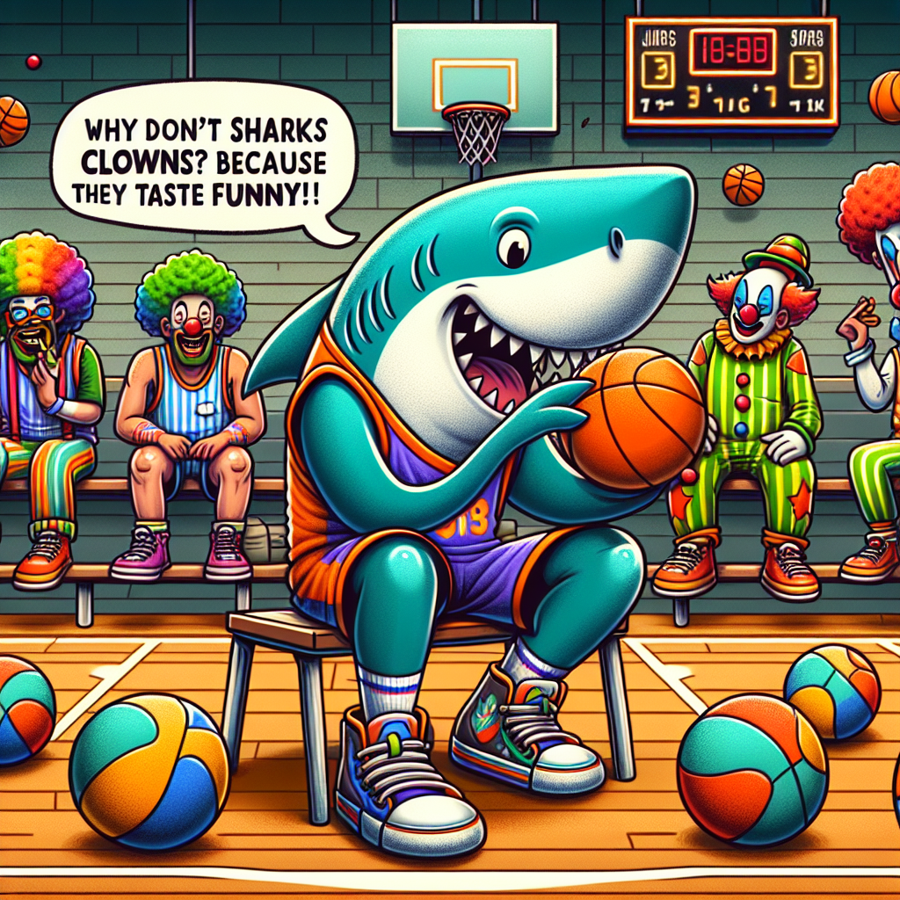

[](https://frontendmasters.com/courses/ai-agents/)

# Build an AI Agent from Scratch Workshop

**Course by Scott Moss**
- Watch the workshop on [Frontend Masters](https://frontendmasters.com/courses/ai-agents/).
- View the [course notes](https://clumsy-humor-894.notion.site/Agent-from-scratch-13554fed51a380749554c44aa8989406?pvs=4)

## Setup Instructions

This repo requires **Node.js version 20+** or **bun v1.0.20**.

The `main` branch contains the final application. You will also need an [API Key from OpenAI](https://platform.openai.com/settings/organization/api-keys).

# AI Agent from Scratch
This project is built as part of the **"Build an AI Agent from Scratch"** course by [Scott Moss](https://frontendmasters.com/teachers/scott-moss/) on [Frontend Masters](https://frontendmasters.com/).

An AI-powered assistant called "Troll" that can perform various tasks using OpenAI's GPT model and custom tools. The agent has memory capabilities and can execute tools to fetch dad jokes, get Reddit posts, and generate images using DALL-E 3.

The agent intelligently decides which tools to use based on your requests, combining multiple tools in sequence to accomplish complex tasks.

## How It Works

The agent uses OpenAI's function calling capabilities to:

1. Analyze user requests and determine which tools are needed
2. Execute tools in sequence, passing results between them
3. Maintain conversation memory using LowDB for persistent context
4. Generate human-like responses based on tool outputs

## Features

- 🤖 **AI Agent**: Powered by OpenAI's GPT models with tool-calling capabilities
- 🧠 **Memory System**: Persistent conversation memory using LowDB
- 🃏 **Dad Jokes**: Fetches random dad jokes from icanhazdadjoke API
- 📰 **Reddit Integration**: Gets latest posts from NBA subreddit
- 🎨 **Image Generation**: Creates images using DALL-E 3
- 💬 **Interactive CLI**: Beautiful terminal interface with loading indicators

## Prerequisites

- [Bun](https://bun.sh/) runtime (or Node.js with tsx)
- OpenAI API key (get one at [OpenAI Platform](https://platform.openai.com/api-keys))

## Setup

1. **Clone and install dependencies:**

```bash
git clone https://github.com/Hendrixer/agent-from-scratch.git
cd agent-from-scratch
git checkout step/1
npm install # or bun install
```

```bash
bun install
```

To run the project: 2. **Set up your OpenAI API key:**
Create a `.env` file in the root directory:

```bash
OPENAI_API_KEY=your_openai_api_key_here
```

## Usage

Run the agent with a message:

```bash
bun run start "Tell me a dad joke"
```

Or directly with tsx:

```bash
npx tsx index.ts "Generate an image of a cat wearing sunglasses"
```

## Example Interaction

**User Input:**

```bash
bun run start "Get a dad joke, get the latest NBA posts from Reddit. Combine the joke theme with NBA elements from the reddit posts to create a humorous, creative image prompt"
```

**Agent Output:**

```
⠦ 🤔
[ASSISTANT]
dad_joke

⠏ done: dad_joke
[ASSISTANT]
reddit

⠴ done: reddit
[ASSISTANT]
generate_image

[ASSISTANT]
Here's a humorous image based on the dad joke and NBA elements! The scene features a cartoon shark in a basketball jersey, sitting on a bench looking confused, surrounded by colorful clowns in basketball uniforms juggling basketballs. One clown is saying, "Why don't sharks eat clowns? Because they taste funny!" In the background, you can see a basketball court with players in action.

```

**Generated Image:**


## Project Structure

```

src/
├── agent.ts # Main agent logic and conversation loop
├── ai.ts # OpenAI client configuration
├── llm.ts # Language model interface
├── memory.ts # Conversation memory management
├── systemPrompt.ts # Agent's system instructions
├── toolRunner.ts # Tool execution logic
├── ui.ts # Terminal UI components
└── tools/ # Available tools
├── dadJoke.ts # Dad joke fetcher
├── reddit.ts # Reddit posts fetcher
└── generateImage.ts # DALL-E image generator
public/
└── image_joke.png # Example generated image

```

## Tools

### Dad Joke Tool

Fetches random dad jokes from the icanhazdadjoke API.

### Reddit Tool

Retrieves the latest posts from the NBA subreddit including titles, links, authors, and upvotes.

### Image Generation Tool

Creates images using OpenAI's DALL-E 3 model. Prompts are automatically refined to avoid celebrity names and ensure appropriate content.

## Built With

- **Bun** - Fast JavaScript runtime and package manager
- **OpenAI API** - GPT models and DALL-E 3
- **LowDB** - Lightweight JSON database for memory
- **Zod** - TypeScript-first schema validation
- **Ora** - Elegant terminal spinners
- **Terminal Image** - Image display in terminal

## Course Information

This project is part of the **"Build an AI Agent from Scratch"** workshop by Scott Moss, available on [Frontend Masters](https://frontendmasters.com/courses/ai-agent/). The course covers:

- Setting up AI agents with tool-calling capabilities
- Memory management for persistent conversations
- Building custom tools and integrations
- Terminal UI development
- Best practices for AI agent development

## Contributing

This is an educational project from the Frontend Masters course. Feel free to explore, modify, and learn from the codebase!

## License

This project is provided for educational purposes as part of the Frontend Masters "Build an AI Agent from Scratch" course by Scott Moss. All rights reserved.

